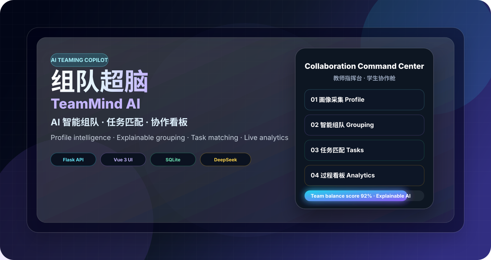
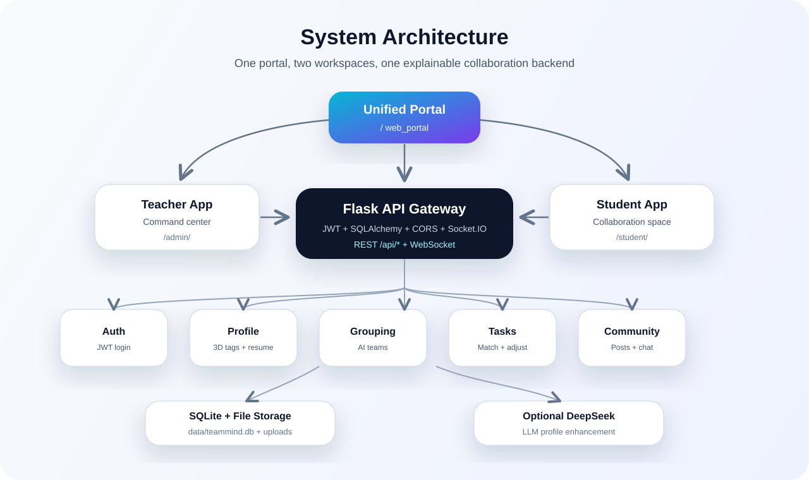
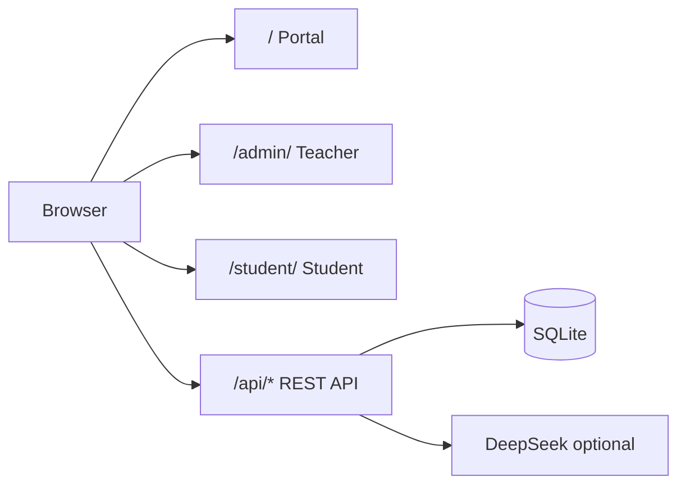
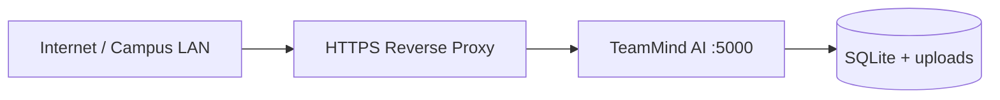

<div align="center">



<br />

<h1>组队超脑 · TeamMind AI</h1>

<h3>AI 智能组队 · 任务匹配 · 协作看板 · 可解释评价</h3>
<h3><em>AI Teaming Copilot for Smart Grouping, Task Matching & Collaboration</em></h3>

<br />

[](https://www.python.org/)
[](https://flask.palletsprojects.com/)
[](https://vuejs.org/)
[](https://www.sqlite.org/)
[](https://platform.deepseek.com/)
[](https://zeabur.com/zh-CN/)
[](LICENSE)

<br />

**[快速开始](#快速开始--quick-start)** ·
**[核心能力](#核心能力--core-capabilities)** ·
**[系统架构](#系统架构--architecture)** ·
**[接口地图](#接口地图--api-map)** ·
**[部署说明](#部署说明--deployment)**

<br />

<table>
  <tr>
    <td align="center" width="25%">
      <strong>🧠 画像驱动</strong><br />
      <sub>主动标签 · 简历解析 · 行为回流</sub>
    </td>
    <td align="center" width="25%">
      <strong>🤝 智能组队</strong><br />
      <sub>技能均衡 · 角色互补 · 可解释分组</sub>
    </td>
    <td align="center" width="25%">
      <strong>🎯 任务匹配</strong><br />
      <sub>难度适配 · 工时负载 · 动态调优</sub>
    </td>
    <td align="center" width="25%">
      <strong>📊 过程看板</strong><br />
      <sub>进度监督 · 风险预警 · 报告导出</sub>
    </td>
  </tr>
</table>

<br />

> **中文**：组队超脑面向高校课程小组、毕业设计、竞赛团队与企业项目制学习，帮助教师从「随机分组 + 人工监督」升级到「**画像驱动 + AI 组队 + 可解释任务匹配 + 过程数据评价**」的闭环协作模式。
>
> **English**: TeamMind AI helps classrooms, capstone projects, competitions and project-based learning teams move from random grouping to a closed-loop workflow powered by profile intelligence, explainable AI grouping, role-aware task matching and collaboration analytics.

</div>

---

## 目录 / Table Of Contents

- [项目亮点 / Highlights](#项目亮点--highlights)
- [核心能力 / Core Capabilities](#核心能力--core-capabilities)
- [产品入口 / Product Entrances](#产品入口--product-entrances)
- [快速开始 / Quick Start](#快速开始--quick-start)
- [演示账号 / Demo Accounts](#演示账号--demo-accounts)
- [系统架构 / Architecture](#系统架构--architecture)
- [协作闭环 / Collaboration Loop](#协作闭环--collaboration-loop)
- [算法与智能 / Algorithms](#算法与智能--algorithms)
- [接口地图 / API Map](#接口地图--api-map)
- [项目结构 / Project Structure](#项目结构--project-structure)
- [配置与安全 / Configuration & Security](#配置与安全--configuration--security)
- [测试与质量 / Testing & Quality](#测试与质量--testing--quality)
- [部署说明 / Deployment](#部署说明--deployment)
- [路线图 / Roadmap](#路线图--roadmap)

---

## 项目亮点 / Highlights

<table>
  <tr>
    <th width="50%">中文</th>
    <th width="50%">English</th>
  </tr>
  <tr>
    <td>🧠 <strong>画像驱动组队</strong><br />融合主动标签、文本/简历解析、被动行为与任务表现，形成知识、技能、协作三维画像。</td>
    <td>🧠 <strong>Profile-driven grouping</strong><br />Combines active tags, text/resume parsing, passive behavior and task performance into knowledge, skill and collaboration profiles.</td>
  </tr>
  <tr>
    <td>🤝 <strong>异构互补分组</strong><br />按技能种子、角色差异、专业多样性、标签互补度进行可解释分组。</td>
    <td>🤝 <strong>Heterogeneous team formation</strong><br />Balances skill seeds, role diversity, major diversity and tag complementarity with explainable notes.</td>
  </tr>
  <tr>
    <td>🎯 <strong>任务智能匹配</strong><br />根据难度、角色偏好、工时负载与依赖关系分配子任务。</td>
    <td>🎯 <strong>Task intelligence</strong><br />Assigns subtasks by difficulty, role preference, workload and dependency priority.</td>
  </tr>
  <tr>
    <td>📊 <strong>过程监督可视化</strong><br />教师端与学生端均可查看任务进度、团队状态、预警和积极性。</td>
    <td>📊 <strong>Visible collaboration process</strong><br />Teacher and student workspaces show progress, team state, alerts and engagement signals.</td>
  </tr>
  <tr>
    <td>☁️ <strong>本地优先 + 公网可部署</strong><br />SQLite + 本地文件存储；支持 Zeabur 一键部署与 Volume 持久化。</td>
    <td>☁️ <strong>Local-first & cloud-ready</strong><br />SQLite and local file storage; deploy to Zeabur with persistent volumes.</td>
  </tr>
  <tr>
    <td>✨ <strong>可选 LLM 增强</strong><br />支持 DeepSeek 画像增强；未配置密钥时可降级到规则与标签评分。</td>
    <td>✨ <strong>Optional LLM enhancement</strong><br />DeepSeek can improve profile parsing while rule/tag scoring remains available without an API key.</td>
  </tr>
</table>

---

## 核心能力 / Core Capabilities

### 1. 学生画像 / Student Profiling

- 中文：支持主动标签选择、自由文本输入、简历上传（PDF/DOC/DOCX）与学习社区行为采集。
- English: Supports active tag selection, free-text input, resume upload (PDF/DOC/DOCX) and behavior signals from the learning community.

画像维度 / Profile dimensions:

| 维度 | 中文说明 | English |
| --- | --- | --- |
| Knowledge | 学历、专业、理论方向、应用领域 | degree, major, theory area and application domain |
| Skill | 编程、数据、AI、设计、表达、工具平台 | programming, data, AI, design, presentation and tools |
| Collaboration | 偏好角色、沟通风格、协作风格、经验与时间投入 | preferred roles, communication style, teamwork style, experience and availability |

### 2. AI 异构分组 / AI Heterogeneous Grouping

- 中文：默认每组 4 人，可按 3-6 人配置；系统优先保障技能均衡，再提升角色互补与标签多样性。
- English: Default group size is 4 and configurable from 3 to 6. The system first balances skills, then improves role complementarity and tag diversity.

核心输出 / Key outputs:

- `groups[]`: 分组结果 / generated groups
- `balance_score`: 均衡评分 / balance score
- `complement_notes`: 互补说明 / complementarity notes
- `audit_log`: 决策追踪 / decision trace

### 3. 任务分配与动态调优 / Task Assignment & Dynamic Adjustment

- 中文：按照任务难度、角色偏好、工时负载、依赖顺序为组员分配任务，并提供“分配依据”。
- English: Assigns tasks according to difficulty, role preference, workload and dependency order, with transparent assignment reasons.

动态调优 / Adjustment signals:

| 倾向 | 触发条件 | 系统动作 |
| --- | --- | --- |
| Positive | 进度 ≥ 80% | 建议提升难度或增加挑战 |
| Negative | 进度 ≤ 40% 或多次逾期 | 降低难度并发出预警 |
| Rebalance | 工时差 > 4h | 建议重新分配或教师确认 |

### 4. 学习社区与私信 / Learning Community & Messaging

- 中文：学生可发布带标签的学习帖子，点赞、收藏、评论和私信会回流为被动标签。
- English: Students can publish tagged posts, while likes, favorites, comments and messages feed back into passive tags.

### 5. 教师指挥舱 / Teacher Command Center

- 中文：教师可查看用户、画像、分组、任务、社区审核、报告与导出。
- English: Teachers can manage users, profiles, groups, tasks, community moderation, reports and exports.

---

## 产品入口 / Product Entrances

<table>
  <tr>
    <th>入口</th>
    <th>默认地址</th>
    <th>使用者</th>
    <th>说明</th>
  </tr>
  <tr>
    <td>🏠 统一门户 / Portal</td>
    <td><code>http://127.0.0.1:5000/</code></td>
    <td>访客、教师、学生</td>
    <td>角色入口与产品展示</td>
  </tr>
  <tr>
    <td>🎓 教师端 / Teacher</td>
    <td><code>http://127.0.0.1:5000/admin/</code></td>
    <td>教师 / 管理员</td>
    <td>课堂指挥舱、分组、任务、报告</td>
  </tr>
  <tr>
    <td>🎒 学生端 / Student</td>
    <td><code>http://127.0.0.1:5000/student/</code></td>
    <td>学生</td>
    <td>画像、社区、团队、任务、看板</td>
  </tr>
  <tr>
    <td>💚 健康检查 / Health</td>
    <td><code>http://127.0.0.1:5000/api/health</code></td>
    <td>开发者</td>
    <td>返回服务状态</td>
  </tr>
</table>

---

## 快速开始 / Quick Start

<div align="center">

### ⚡ 三步启动 · Three Steps to Launch

</div>

<table>
  <tr>
    <td width="33%" align="center">
      <strong>1️⃣ 安装依赖</strong><br /><sub>Install</sub>
    </td>
    <td width="33%" align="center">
      <strong>2️⃣ 一键启动</strong><br /><sub>Start</sub>
    </td>
    <td width="33%" align="center">
      <strong>3️⃣ 打开浏览器</strong><br /><sub>Explore</sub>
    </td>
  </tr>
</table>

```powershell
# 1. 安装依赖
pip install -r backend/requirements.txt --index-url https://pypi.org/simple/

# 2. 启动全部服务（门户 + 教师端 + 学生端 + API）
python main.py

# 3. 访问 http://127.0.0.1:5000/
```

<details>
<summary><strong>📋 环境要求 / Requirements</strong></summary>

| 依赖 | 版本 | 说明 |
| --- | --- | --- |
| Python | 3.10+ | 后端 API、算法、启动器 |
| Node.js | 可选 / optional | 仅当你需要构建 `frontend/` Vue 源码时使用 |
| SQLite | 内置 / built-in | 默认本地数据库 |

</details>

<details>
<summary><strong>🔄 重建演示数据库 / Rebuild Demo Database</strong></summary>

```powershell
python main.py --init
```

> 注意：`--init` 会重建本地 SQLite 数据库，适合首次演示或重置测试环境。
>
> Note: `--init` rebuilds the local SQLite database. Use it for first-time demos or test resets.

</details>

---

## 演示账号 / Demo Accounts

> **正式上线 / Production**：学员请使用 **邮箱验证码注册**（`/student/`）；教师账号由 `python scripts/bootstrap_production.py` 创建。生产环境请设置 `TEAMMIND_DISABLE_DEMO_SEED=1`、`TEAMMIND_ALLOW_LEGACY_REGISTER=0`，并配置 SMTP。详见 [`docs/DEPLOY.md`](docs/DEPLOY.md)。

<table>
  <tr>
    <th>角色</th>
    <th>账号</th>
    <th>密码</th>
    <th>说明</th>
  </tr>
  <tr>
    <td>👨‍🏫 管理员 / Admin</td>
    <td><code>admin</code></td>
    <td><code>admin123</code></td>
    <td>教师端演示账号</td>
  </tr>
  <tr>
    <td>🎒 学生 / Student</td>
    <td><code>zhangsan</code></td>
    <td><code>123456</code></td>
    <td>内置学生演示账号</td>
  </tr>
  <tr>
    <td>👥 批量学生 / Batch</td>
    <td><code>student01</code> - <code>student20</code></td>
    <td><code>123456</code></td>
    <td>由演示脚本生成</td>
  </tr>
</table>

**20 人答辩演示 / 20-student demo flow:**

```powershell
python main.py --no-browser
python scripts/demo_flow_20students.py --reset
```

脚本会自动完成 20 人注册、画像、AI 分组、角色分配、任务分配和部分进度模拟。

The script creates 20 demo students, generates profiles, forms teams, assigns roles and tasks, and simulates partial progress.

---

## 系统架构 / Architecture

<div align="center">
  
</div>

### 技术栈 / Tech Stack

| 层级 | 技术 | English |
| --- | --- | --- |
| 门户与内置页面 | `web_portal/`, `web_embedded_admin/`, `web_embedded/` | static portal, teacher app and student app |
| Vue 源码 | `frontend/` + Vue 3 + Element Plus + Pinia + ECharts | optional source frontend |
| 后端 API | Flask, Flask-JWT-Extended, Flask-SQLAlchemy, Flask-CORS | REST API and permissions |
| 实时能力 | Flask-SocketIO | real-time messaging/event support |
| 调度任务 | APScheduler | periodic adjustment jobs |
| 存储 | SQLite + local uploads | local database and file storage |
| 文档导出 | OpenPyXL + ReportLab | Excel and PDF exports |
| 解析能力 | pypdf + python-docx + optional DeepSeek | resume/text parsing and LLM enhancement |

### 请求流 / Request Flow



---

## 协作闭环 / Collaboration Loop

<div align="center">
  
</div>

| 阶段 | 学生体验 | 教师体验 | 系统价值 |
| --- | --- | --- | --- |
| 画像采集 | 选择标签、输入经历、上传简历 | 查看班级画像完成率 | 让组队从数据开始 |
| 候选匹配 | 查看推荐队友与角色 | 生成候选分组并检查依据 | 让 AI 建议可解释 |
| 组队确认 | 接受或申请微调 | 处理微调并锁定团队 | 保留人的判断 |
| 任务分配 | 查看任务、负责人、截止时间 | 配置任务模板并分配 | 让责任边界清晰 |
| 过程监督 | 更新进度、查看队友动态 | 看板监督、预警、导出 | 支持形成性评价 |

---

## 算法与智能 / Algorithms

### 画像融合 / Profile Fusion

组队超脑（TeamMind AI）融合四类信号 / The platform combines four signal sources:

```text
Active tags + LLM parsing + Passive behavior + Task behavior
```

综合评分 / Composite scoring:

```text
Knowledge_final = 0.30 * K_active + 0.30 * K_llm + 0.15 * K_passive + 0.15 * K_task + 0.10 * K_rule
Skill_final     = 0.35 * S_active + 0.30 * S_llm + 0.15 * S_passive + 0.20 * S_task
Collab_final    = 0.25 * C_active + 0.20 * C_llm + 0.30 * C_passive + 0.25 * C_task
```

### 异构分组 / Heterogeneous Grouping

```text
gain = skill_diversity - role_duplicate * 2 - major_duplicate * 3 + style_bonus
gain += tag_diversity * 2.0
```

流程 / Process:

1. 按技能分选择高技能种子 / seed teams by high-skill students.
2. 计算候选成员加入后的互补增益 / compute complementarity gain.
3. 控制组间技能均分差与专业重复 / constrain skill balance and major duplication.
4. 进行局部 swap 微调 / improve groups with local swaps.
5. 输出均衡评分与互补说明 / return balance score and explainable notes.

### 任务匹配 / Task Matching

任务分配考虑 / Assignment considers:

- 难度与能力匹配 / difficulty-to-skill fit
- 偏好角色 / preferred role
- 当前工时负载 / current workload
- 依赖任务优先级 / dependency priority
- 教师可人工确认 / teacher confirmation

更多细节见 / More details:

- [算法文档 / Algorithm Documentation](docs/ALGORITHM.md)
- [画像标签体系 / Profile Tag System](docs/PROFILE_TAGS.md)
- [协作学习设计 / Collaborative Learning Design](docs/COLLAB_LEARNING.md)

---

## 接口地图 / API Map

Base URL:

```text
http://localhost:5000/api
```

认证方式 / Authentication:

```http
Authorization: Bearer <token>
```

| 模块 | 方法与路径 | 说明 |
| --- | --- | --- |
| Auth | `POST /auth/register` | 用户注册 / register |
| Auth | `POST /auth/login` | 登录并返回 token / login |
| Profile | `POST /profile/submit` | 主动标签 + 文本画像 / submit profile |
| Profile | `POST /profile/resume` | 上传简历 / upload resume |
| Profile | `GET /profile/current` | 当前综合画像 / current profile |
| Community | `GET /community/feed` | 学习社区 Feed / community feed |
| Community | `POST /community/posts` | 发布帖子 / create post |
| Chat | `GET /chat/conversations` | 会话列表 / conversations |
| Group | `POST /group/create` | AI 分组 / create groups |
| Group | `GET /group/list` | 分组列表 / group list |
| Task | `POST /task/assign` | 任务分配 / assign tasks |
| Task | `POST /task/adjust` | 动态调优 / adjust tasks |
| Board | `GET /board/sync` | 团队看板 / team board |
| Report | `POST /report/generate` | 生成报告 / generate report |
| Export | `GET /export/{type}?format=xlsx\|pdf` | 导出 Excel/PDF / export |
| Admin | `GET /admin/overview` | 管理总览 / admin overview |

完整接口见 / Full API documentation: [docs/API.md](docs/API.md)

---

## 项目结构 / Project Structure

```text
TeamMind-AI/
├── main.py                       # 统一启动入口 / unified launcher
├── main_admin.py                 # 兼容教师端入口 / legacy admin launcher
├── main_user.py                  # 兼容学生端入口 / legacy student launcher
├── backend/
│   ├── app/
│   │   ├── api/                  # REST API 蓝图 / API blueprints
│   │   ├── models/               # SQLAlchemy 数据模型 / models
│   │   ├── services/             # 画像、分组、任务、导出服务 / services
│   │   ├── scheduler/            # 周期调优任务 / scheduled jobs
│   │   └── data/tag_catalog.json # 三维标签库 / tag catalog
│   ├── tests/                    # 自动化测试 / tests
│   └── requirements.txt          # Python 依赖 / Python dependencies
├── database/
│   ├── init_db.py                # 数据库初始化 / database initialization
│   ├── schema.sql                # SQLite schema
│   └── seeds/                    # 教学演示数据 / demo seed data
├── web_portal/                   # 统一门户静态资源 / portal static app
├── web_embedded_admin/           # 教师端静态资源 / teacher static app
├── web_embedded/                 # 学生端静态资源 / student static app
├── frontend/                     # Vue 3 源码 / optional Vue source app
├── scripts/                      # 启动、演示、冒烟测试脚本 / scripts
├── docs/                         # 项目文档与 README 图片 / documentation and images
├── CONTRIBUTING.md
├── LICENSE
└── README.md
```

---

## 配置与安全 / Configuration & Security

### 关键环境变量 / Key Environment Variables

| 变量 | 默认值 | 说明 |
| --- | --- | --- |
| `TEAMMIND_ENV` | `development` | 设置为 `production` 启用生产安全校验 |
| `SECRET_KEY` | 开发默认值 | Flask 密钥，生产必须设置 |
| `JWT_SECRET_KEY` | 开发默认值 | JWT 密钥，生产必须设置 |
| `TEAMMIND_CORS_ORIGINS` | `*` | 生产环境必须指定明确域名 |
| `TEAMMIND_SOCKETIO_CORS_ORIGINS` | 跟随 CORS | WebSocket 跨域配置 |
| `DEEPSEEK_API_KEY` | 空 | 可选 LLM 画像增强 |
| `DEEPSEEK_BASE_URL` | `https://api.deepseek.com` | DeepSeek API 地址 |
| `DEEPSEEK_MODEL` | `deepseek-chat` | DeepSeek 模型 |
| `DEEPSEEK_ENABLED` | `1` | 设置为 `0` 可关闭 LLM |

### 数据目录 / Data Directories

| 路径 | 说明 |
| --- | --- |
| `data/teammind.db` | SQLite 数据库 |
| `data/uploads/` | 公开社区媒体 |
| `data/private_uploads/resumes/` | 私有简历文件，不通过静态路由公开 |
| `data/logs/` | 本地日志目录 |

### 生产安全清单 / Production Checklist

- 设置 `TEAMMIND_ENV=production`。
- 使用至少 32 位随机字符串设置 `SECRET_KEY` 与 `JWT_SECRET_KEY`。
- 将 `TEAMMIND_CORS_ORIGINS` 限制为真实域名。
- 重置或禁用默认演示账号。
- 不要把真实 `DEEPSEEK_API_KEY` 写入代码或提交到仓库。
- 建议只暴露 HTTPS 反向代理后的 `5000` 入口。

---

## 测试与质量 / Testing & Quality

### 后端测试 / Backend Tests

```powershell
pytest -q
```

覆盖内容 / Coverage includes:

- NLP 文本解析 / NLP parsing
- 画像评分 / profile scoring
- 分组均衡性 / grouping balance
- API 端到端 / API E2E
- 权限边界 / permission boundaries
- 被动标签与任务行为管线 / passive tag and task behavior pipelines

### 前端静态脚本检查 / Static JavaScript Checks

```powershell
node --check web_portal/assets/portal.js
node --check web_embedded/assets/app.js
node --check web_embedded_admin/assets/app.js
```

### 系统自检 / Self Check

```powershell
python backend/scripts/self_check.py
```

### UI 冒烟测试 / UI Smoke Test

```powershell
python main.py --no-browser
python scripts/ui_smoke_test.py --base-url http://127.0.0.1:5000
```

更多见 / More details: [docs/TEST_REPORT.md](docs/TEST_REPORT.md)

---

## 部署说明 / Deployment

<table>
  <tr>
    <th>场景</th>
    <th>命令 / 配置</th>
    <th>说明</th>
  </tr>
  <tr>
    <td>🏫 本地课堂</td>
    <td><code>python main.py</code></td>
    <td>一键启动三端 + API</td>
  </tr>
  <tr>
    <td>🌐 局域网 / 公网</td>
    <td><code>python main.py --host 0.0.0.0 --no-browser</code></td>
    <td>需配置 <code>TEAMMIND_ENV=production</code> 与安全密钥</td>
  </tr>
  <tr>
    <td>☁️ Zeabur 部署</td>
    <td><code>zbpack.json</code> + Volume <code>/src/data</code></td>
    <td>见下方 Zeabur 专节与 <a href="docs/DEPLOY.md">docs/DEPLOY.md</a></td>
  </tr>
</table>

### 本地课堂演示 / Local Classroom Demo

```powershell
pip install -r backend/requirements.txt --index-url https://pypi.org/simple/
python main.py
```

### 局域网或公网部署 / LAN Or Public Deployment

```powershell
$env:TEAMMIND_ENV="production"
$env:SECRET_KEY="<at-least-32-random-chars>"
$env:JWT_SECRET_KEY="<at-least-32-random-chars>"
$env:TEAMMIND_CORS_ORIGINS="https://your-domain.example"
python main.py --host 0.0.0.0 --no-browser
```



完整部署说明见 / Full deployment guide: [docs/DEPLOY.md](docs/DEPLOY.md)

### Zeabur 公网一键部署 / Zeabur Public Deployment

[](https://zeabur.com/zh-CN/)

仓库已包含 [`zbpack.json`](zbpack.json)、[`.env.example`](.env.example) 与 [`zeabur.template.yaml`](zeabur.template.yaml)。在 [Zeabur](https://zeabur.com/zh-CN/) 导入 `FrankDengAI/TeamMind_AI` 后，配置环境变量并挂载 Volume 至 `/src/data` 即可。

```bash
python scripts/verify_zeabur_deploy.py --base-url https://your-app.zeabur.app
```

---

## 常用命令 / Common Commands

| 命令 | 中文说明 | English |
| --- | --- | --- |
| `python main.py` | 启动统一门户、教师端、学生端、API | start portal, apps and API |
| `python main.py --init` | 重建数据库后启动 | rebuild database then start |
| `python main.py --host 0.0.0.0 --no-browser` | 局域网/公网部署模式 | LAN/public mode |
| `python main.py --kill-port` | 开发调试时释放占用端口 | free occupied ports for development |
| `python main_admin.py` | 兼容入口：只启动后台与教师端 | legacy admin launcher |
| `python main_user.py` | 可选兼容入口：单独启动学生端，需后台已运行 | optional legacy student launcher |
| `python scripts/demo_flow_20students.py --reset` | 生成 20 人演示流程 | generate 20-student demo |
| `python scripts/ui_smoke_test.py --base-url http://127.0.0.1:5000` | 浏览器冒烟测试 | UI smoke test |

学生端静态资源默认在 `frontend/dist` 存在时优先使用构建版；如需固定使用内置学生端，可设置 `TEAMMIND_STUDENT_UI=embedded`，或用 `TEAMMIND_STUDENT_UI=dist` 明确使用构建版。

---

## 文档 / Documentation

<table>
  <tr>
    <td>📦 <a href="docs/DEPLOY.md">部署文档 / Deployment</a></td>
    <td>🔌 <a href="docs/API.md">接口文档 / API</a></td>
    <td>🧮 <a href="docs/ALGORITHM.md">算法文档 / Algorithms</a></td>
  </tr>
  <tr>
    <td>🏷️ <a href="docs/PROFILE_TAGS.md">画像标签 / Profile Tags</a></td>
    <td>🤝 <a href="docs/COLLAB_LEARNING.md">协作学习 / Collaborative Learning</a></td>
    <td>🏗️ <a href="docs/ARCHITECTURE_FLOW.md">架构流程 / Architecture Flow</a></td>
  </tr>
  <tr>
    <td>🧪 <a href="docs/TEST_REPORT.md">测试报告 / Test Report</a></td>
    <td>🔍 <a href="docs/CODE_REVIEW_REPORT.md">代码审查 / Code Review</a></td>
    <td>🖼️ <a href="docs/MULTIMODAL.md">多模态说明 / Multimodal</a></td>
  </tr>
</table>

---

## 路线图 / Roadmap

- 中文：更细粒度的课程活动管理、更多任务模板、教师评分 Rubric、团队互评、可插拔 LLM Provider、Docker/Compose 部署模板。
- English: finer-grained course activity management, more task templates, teacher grading rubrics, peer review, pluggable LLM providers and Docker/Compose deployment templates.
- **V2 计费（已落地）**：Freemium 套餐、AI 点数、扫码支付与订单核销 — 见 [docs/BILLING.md](docs/BILLING.md)。
- **高级功能与商业化规划**：对标 Canvas / 飞书 / Notion / Copilot 的能力地图、分阶段路线与 Pro/Plus 收费设计 — 见 [docs/PRODUCT_PREMIUM_ROADMAP.md](docs/PRODUCT_PREMIUM_ROADMAP.md)。

---

## 适用场景 / Use Cases

| 场景 | 中文价值 | English Value |
| --- | --- | --- |
| 高校课程项目 | 快速形成互补小组，保留过程评价依据 | form balanced groups and keep evidence for formative assessment |
| 毕业设计 / Capstone | 根据能力与角色进行长期团队协作管理 | manage long-running teams by capability and role |
| 创新创业竞赛 | 快速发现技术、产品、设计、汇报型成员 | identify technical, product, design and presentation profiles |
| 企业项目制学习 | 将任务、进度、风险与协作表现透明化 | make tasks, progress, risks and collaboration visible |

---

## 贡献 / Contributing

欢迎提交 Issue 与 Pull Request。请在提交前尽量运行相关测试，并参考 [CONTRIBUTING.md](CONTRIBUTING.md)。

Issues and pull requests are welcome. Please run relevant tests before submitting and see [CONTRIBUTING.md](CONTRIBUTING.md).

---

## 许可证 / License

本项目基于 [MIT License](LICENSE) 开源。

This project is released under the [MIT License](LICENSE).

---

<p align="center">
  <br />
  
  <br /><br />
  <strong>组队超脑 · TeamMind AI</strong><br />
  <em>让组队、分工、协作和评价都有据可依</em><br />
  <em>Make team formation, task ownership, collaboration and assessment explainable</em>
  <br /><br />
  <sub>Built with Flask · Vue · SQLite · DeepSeek · MIT License</sub>
</p>
