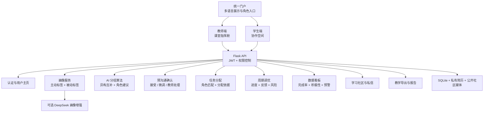
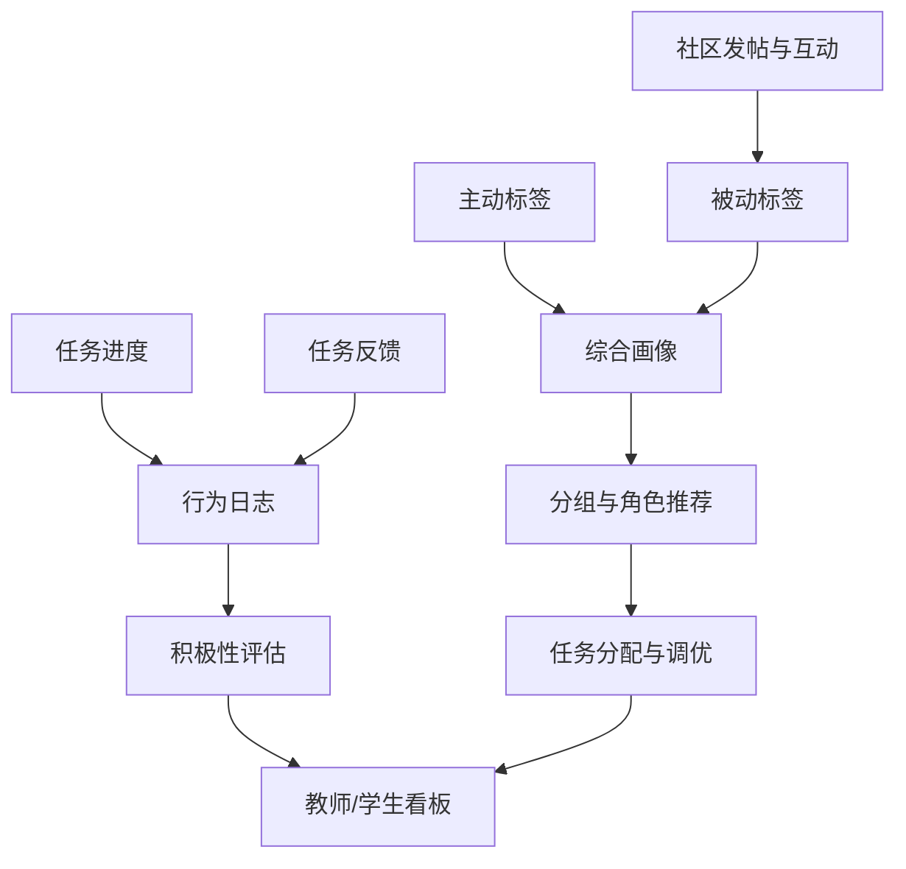

# 组队超脑（TeamMind AI）项目架构与课堂流程图

本文档用于公开演示、答辩和课堂试运行说明，帮助教师、学生和评审快速理解 TeamMind AI 的完整闭环。

## 系统架构图

## 课堂业务流程图

```mermaid
flowchart LR
  Start["学生注册登录"] --> ProfileInput["填写画像<br/>标签 + 文本 + 简历"]
  ProfileInput --> Match["候选分组<br/>能力互补 + 角色建议"]
  Match --> PreTalk["预沟通阶段<br/>查看队友与依据"]
  PreTalk --> StudentDecision["学生确认<br/>接受或申请微调"]
  StudentDecision --> TeacherResolve["教师处理<br/>调整角色或驳回"]
  TeacherResolve --> LockTeam["锁定正式团队"]
  LockTeam --> AssignTask["任务拆解分配"]
  AssignTask --> Collaboration["一周协作<br/>进度更新 + 社区沟通"]
  Collaboration --> Feedback["任务反馈<br/>过重 / 不适配 / 需帮助"]
  Feedback --> Adjustment["AI 调优建议"]
  Adjustment --> Dashboard["实时看板"]
  Dashboard --> Assessment["督促 / 评分 / 形成性评价"]
```

## 数据与反馈闭环

## 四阶段能力对应

| 阶段 | 学生体验 | 教师体验 | 系统亮点 |
|------|----------|----------|----------|
| 画像与候选匹配 | 选择标签、补充经历、查看推荐角色 | 查看班级画像完成率和能力结构 | 多维画像、角色建议、异构互补 |
| 预沟通与组队确认 | 查看候选队友、接受或申请微调 | 处理微调、锁定团队 | AI 建议 + 人类确认 |
| 任务分配与周期调优 | 查看任务、更新进度、提交反馈 | 分配任务、查看风险、确认调优 | 分配依据可解释、反馈驱动调优 |
| 数据看板与评价 | 看到队友动态和团队进展 | 过程监督、督促、导出评分依据 | 完成率、积极性、风险和反馈汇总 |

