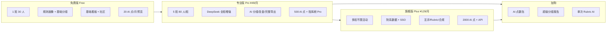

# TeamMind AI 高级功能规划与商业化设计

> 目标：对标主流教育协作产品（Canvas / Moodle、飞书教育、ClassIn、Notion、GitHub Classroom）与 AI 教育助手（Copilot for Education、Khanmigo 类），在**不偏离「画像 → 组队 → 任务 → 过程评价」主线**的前提下，补齐大厂级体验，并把高价值能力纳入 **Free / Pro / Plus + AI 点数 + 单次加购** 体系。

---

## 1. 产品定位（一句话）

**「课堂里的 AI 组队副驾驶」**：教师用指挥舱管班、管活动、管过程；学生在协作空间里完成画像、确认队伍、执行任务；系统用可解释 AI 降低分组摩擦，用数据支撑形成性评价。

与纯 LMS（Canvas）或纯文档（Notion）的差异：**组队与任务匹配是内核**，其它能力围绕这条闭环增强留存与付费转化。

---

## 2. 对标地图（我们已有 vs 待补齐）

| 大厂/主流能力域 | 代表产品 | TeamMind 现状 | 规划方向 |
|----------------|----------|---------------|----------|
| 课程与班级 | Canvas、超星、雨课堂 | 班级、审批、活动 | 学期时间轴、课表同步、批量导入 |
| 分组与角色 | GitHub Classroom、自行组队 | 异构分组、自由组队、预沟通 | 多策略模板、互评组队、回避规则 |
| 任务与看板 | Trello、飞书项目 | 任务分配、进度、调优 | 看板视图、里程碑、依赖图 |
| 沟通 | Slack、飞书 IM | 私信、社区 | 小组频道、@提醒、公告 |
| 知识库 | Notion、语雀 | 社区帖子 | 小组 Wiki、作业 Rubric 库 |
| AI 助手 | Copilot、通义课堂 | DeepSeek 画像/分组/复盘 | 班级 Copilot、教案生成、风险日报 |
| 评价 | Turnitin、Rubric | 行为日志、报告导出 | Rubric 评分、互评、成长档案 |
| 数据 | 钉钉宜搭、Tableau | 指挥舱、AI 用量 | 院系看板、预警规则、对比分析 |
| 开放 | LTI、SSO | JWT、Webhook 支付 | 学校 SSO、LTI 1.3、开放 API |

---

## 3. 功能分层总览（收费设计）

---

## 4. 高级功能清单（按模块）

### 4.1 教师指挥舱 · 对标 Canvas + 飞书多维表

| 功能 | 用户价值 | 收费建议 | 实现要点 | 优先级 |
|------|----------|----------|----------|--------|
| **学期时间轴** | 按周展示：建班→画像截止→组队→中期检查→期末 | Free 只读；Pro 可编辑节点 | `class_timeline` 表 + 门户提醒 | P1 |
| **一键催办（Nudge）** | 未填画像/未确认队伍的学生批量提醒 | Pro | 站内信 + 可选邮件/Webhook | P1 |
| **班级健康度仪表盘** | 画像完成率、组队进度、任务风险热力图 | Pro 基础；Plus 跨班对比 | 扩展 `analytics_service` | P0（增强现有指挥舱） |
| **自定义预警规则** | 「连续 3 天无进度」「反馈过重≥2 人」自动标红 | Plus | 规则引擎 + 通知 | P2 |
| **院系/教研室视图** | 多教师、多班汇总（系主任视角） | Plus | `org_id` + 角色 `dept_admin` | P2 |
| **批量导入学生** | Excel/学号名单，对标教务系统 | Pro | 已有 seed 可扩展为上传 API | P1 |

### 4.2 智能组队 · 对标 GitHub Classroom + AI

| 功能 | 用户价值 | 收费建议 | AI 点数 | 优先级 |
|------|----------|----------|---------|--------|
| **分组策略模板库** | 异构/同质/竞赛队/随机+约束（同寝回避、成绩均衡） | Free 3 个；Pro 20 个；Plus 不限 | 应用模板 0；AI 建议 5 点 | P0 |
| **约束分组（硬规则）** | 必须/禁止同组、角色配额（每队 1 技术+1 设计） | Pro | 算法扩展 `grouping.py` | P1 |
| **多方案对比（A/B/C）** | 教师并排看 3 套分组方案的均衡度与风险 | Pro 预览 1 次/月；完整 Pro | 每组方案 5 点 | P1 |
| **学生志愿与撮合** | 学生填「想与谁/不想与谁」，AI 在满足约束下优化 | Plus | 8 点/次 | P2 |
| **超级分组报告（已规划加购）** | PDF：每队互补分析、教师话术、家长可读摘要 | ¥9.9/次 或 Plus 含 N 次 | 15 点 | P1 |
| **分组公平性审计** | 性别/专业/成绩方差报告，应对教务合规 | Plus | 3 点 | P2 |

### 4.3 任务与协作 · 对标 Trello + 飞书项目

| 功能 | 用户价值 | 收费建议 | AI 点数 | 优先级 |
|------|----------|----------|---------|--------|
| **看板视图（Kanban）** | 拖拽改状态，学生端主流体验 | Free | 前端视图，复用 Task API | P0 |
| **里程碑与甘特简图** | 课程项目节点一目了然 | Pro | `milestone` 实体 | P1 |
| **任务模板市场** | 「课程设计」「竞赛路演」一键生成子任务 | Free 3；Pro 20；Plus 共享到校级 | 模板应用 0；AI 生成 4 点 | P1 |
| **工时与负载均衡视图** | 谁过载、谁闲置，对标大厂 resource 视图 | Pro | 基于现有 `workload` 算法可视化 | P1 |
| **小组 Wiki / 交付物** | 链接、文件、版本说明（轻量 Notion） | Pro 每队 50MB；Plus 500MB | 存储计费可加购 | P2 |
| **小组频道** | 组内消息流，减少私信碎片化 | Free 文字；Pro 富文本 | 复用 Chat + `group_id` | P1 |

### 4.4 AI 副驾驶 · 对标 Copilot for Education

| 功能 | 用户价值 | 收费建议 | AI 点数 | 优先级 |
|------|----------|----------|---------|--------|
| **班级 Copilot 侧边栏** | 教师自然语言：「谁最可能拖进度」「如何拆第 3 周任务」 | Pro 500 点内；超出买点数 | 按轮次 2–8 点 | P1 |
| **活动复盘增强（已有）** | 活动结束 AI 总结、改进建议 | Pro | 8 点（已有） | 已部分落地 |
| **教案/任务单生成** | 根据课程目标生成项目说明 + Rubric 草案 | Pro | 6 点 | P1 |
| **学生风险日报** | 每日推送「需关注 5 人」及建议动作 | Plus | 10 点/班/天 | P2 |
| **可解释性卡片** | 每次 AI 输出附「依据标签/行为片段」 | Free 预览；Pro 完整 | 增强现有 `score_breakdown` | P0 |
| **多模型切换** | DeepSeek / 校内 API / 离线规则 | Plus | 配置层，不计点或加价 | P2 |

### 4.5 评价与成长 · 对标 Turnitin + Peerceptiv

| 功能 | 用户价值 | 收费建议 | AI 点数 | 优先级 |
|------|----------|----------|---------|--------|
| **Rubric 评分表** | 教师定义维度与权重，对标 Canvas SpeedGrader | Pro 5 套；Plus 不限 | 0 | P1 |
| **组内互评 + 去极值** | 贡献度互评，防「搭车」 | Plus | 0；AI 解读 5 点 | P2 |
| **个人成长档案** | 学期画像变化、标签演化、教师评语时间线 | Pro 导出；Plus 学生可见全量 | 2 点/生成 | P2 |
| **形成性评价报告** | 一键生成「过程分+建议」，非仅终稿 | Pro PDF 10 份/月；Plus 不限 | 10 点（已有 PDF） | P1 |
| **学术诚信提示** | 异常相似提交、进度突变（轻量，非全文查重） | Plus | 规则为主；AI 5 点 | P3 |

### 4.6 学生体验 · 对标 Notion + 小红书式社区

| 功能 | 用户价值 | 收费建议 | 优先级 |
|------|----------|----------|--------|
| **个人主页 Pro 化** | 作品集、技能徽章、组队历史 | Free 基础；学生永远免费 | P1 |
| **匹配推荐流** | 「你可能适合的队伍/帖子」 | Free 规则；Pro 班内 AI 推荐 | P2 |
| **移动端 PWA** | 扫码进班、推送提醒 | Free | P1 |
| **多语言完善** | 中英繁 + 课堂术语表 | Free | 进行中 |

### 4.7 开放与政企 · 对标大厂采购清单

| 功能 | 用户价值 | 收费建议 | 优先级 |
|------|----------|----------|--------|
| **学校 SSO（CAS/OAuth）** | 统一身份，教务处买单 | Plus 或校级合同 | P2 |
| **LTI 1.3 工具** | 嵌入 Moodle/Canvas 作为「组队工具」 | Plus / 校级 | P3 |
| **开放 API + Webhook** | 成绩回写、订单/预警推送 | Plus | P2 |
| **白标与自定义域名** | 学校品牌门户 | 校级年费 | P3 |
| **审计日志导出** | 合规留痕 | Plus | P1（增强 audit_log） |

---

## 5. 商业化矩阵（建议写入 `plan_catalog` 下一版）

### 5.1 套餐权益扩展（limits 字段建议）

| limit 键 | Free | Pro | Plus |
|----------|------|-----|------|
| `max_classes` | 1 | 5 | ∞ |
| `max_students_per_class` | 30 | 80 | 200 |
| `max_active_activities` | 1 | 10 | ∞ |
| `ai_points_monthly` | 20 | 500 | 2000 |
| `command_dashboard_pro` | false | true | true |
| `deep_grouping` | false | true | true |
| `grouping_scenario_compare` | 0 | 10/月 | ∞ |
| `custom_alert_rules` | 0 | 3 | 20 |
| `rubric_sets` | 0 | 5 | ∞ |
| `peer_review_enabled` | false | false | true |
| `group_wiki_mb` | 0 | 50 | 500 |
| `class_copilot_daily` | 0 | 30 轮/月 | 200 轮/月 |
| `dept_dashboard` | false | false | true |
| `sso_enabled` | false | false | true |
| `api_access` | false | false | true |
| `pdf_report_monthly` | 0 | 10 | ∞ |

### 5.2 加购包扩展（`ADDON_CATALOG`）

| code | 名称 | 定价建议 | 说明 |
|------|------|----------|------|
| `ai_pack_200` | AI 点数包 200 | ¥19 | 已有 |
| `ai_pack_1000` | AI 点数包 1000 | ¥79 | 已有 |
| `super_group_report` | 超级分组报告 | ¥9.9/次 | 已有 |
| `rubric_ai_pack` | Rubric+评语 AI 10 次 | ¥29 | 期末周爆款 |
| `nudge_sms_100` | 短信催办 100 条 | ¥49 | 对接短信网关 |
| `storage_10gb` | 小组 Wiki 存储 10GB/年 | ¥99 | 校级可谈 |

### 5.3 AI 点数扩展（`AI_POINT_COSTS`）

| feature | 点数 | 说明 |
|---------|------|------|
| `class.copilot` | 3/轮 | 班级 Copilot 对话 |
| `lesson.plan` | 6 | 教案/任务单生成 |
| `grouping.scenario` | 5 | 多方案对比一套 |
| `risk.daily` | 10 | 班级风险日报 |
| `peer.review.summary` | 5 | 互评结果 AI 解读 |
| `growth.portfolio` | 2 | 个人成长档案 |

---

## 6. 分阶段落地路线图

### Phase A（4–6 周）— 体验对齐主流，促 Pro 转化 ✅ 已落地首版

1. **指挥舱 Pro 增强**：班级健康度、催办名单、学期时间轴（Pro 可编辑）— `classroom_insights` + 教师端「班级管理」新 Tab
2. **看板视图**：学生端「我的任务」列表/看板切换
3. **分组策略模板库** — `GET /api/group/templates`，自动分组可选 Pro 模板
4. **班级 Copilot** — `POST /api/copilot/class/:id/ask`（Pro，3 AI 点/次）
5. **套餐门禁**：`plan_catalog` 扩展 `class_copilot`、`timeline_editable` 等 limits

**预期效果**：教师感受到「像飞书项目 + 轻量 Canvas」，愿意为 AI 与导出付费。

### Phase B（6–10 周）— 评价闭环，促 Plus / 校级

1. **Rubric 评分** + 过程评价 PDF 增强
2. **多方案分组对比** + 超级分组报告商品化
3. **小组频道 + 里程碑**
4. **预警规则 + 审计导出**
5. **开放 API（只读统计 + Webhook 事件）**

**预期效果**：支撑完整「过程性评价」，适合院系采购 Plus。

### Phase C（10–16 周）— 大厂采购项

1. **SSO + 院系看板**
2. **组内互评 + 成长档案**
3. **LTI 工具 / 白标**
4. **轻量学术诚信提示**

---

## 7. 与现有代码的衔接（实施时不走弯路）

| 规划功能 | 建议落点 |
|----------|----------|
| 权益门禁 | `plan_catalog.py` + `entitlement_service.check_limit` |
| AI 扣点 | `consume_ai_points` + 新 `AI_POINT_COSTS` |
| 教师 UI | `web_embedded_admin/assets/app.js` 新 page 或 drawer |
| 学生 UI | `web_embedded` 看板/社区扩展 |
| 数据模型 | `Classroom` / `TeamActivity` / `GroupInfo` 旁加 `timeline`、`rubric`、`milestone` 表 |
| 支付 | 已有 `billing_service` + 新 `ADDON_CATALOG` 项 |
| 定时任务 | `scheduler/jobs.py` 增加日报、过期订单（已有） |

---

## 8. 定价与包装话术（对外）

| 版本 | 一句话 | 适合谁 |
|------|--------|--------|
| **Free** | 跑通一次完整组队课 | 试用教师、小班体验 |
| **Pro** | 日常开课的全能 AI 助教 | 单教师多课程 |
| **Plus** | 院系与工作室的统一协作中台 | 教研室、双创基地、企业大学 |
| **加购** | 期末高峰不升级也能买点数/报告 | 短期活动、竞赛周 |

**升级触发点（UX）**：AI 预览截断、导出带水印、第二班级、深度分组、Copilot 超限、PDF 用尽 — 均已有 402 机制，新功能继续复用 `PaywallError`。

---

## 9. 建议优先做的 5 个「高级收费点」（投入产出比最高）

1. **班级 Copilot** — 差异化强，消耗 AI 点数，粘住教师每日打开。
2. **分组多方案对比 + 超级报告** — 直接对应「分组难」痛点，适合单次 ¥9.9 加购。
3. **指挥舱健康度 + 催办** — 提升完成率，促使 Free → Pro。
4. **Rubric + 过程评价 PDF** — 教务语言，利于院系采购 Plus。
5. **看板 + 任务模板** — 学生端现代感，口碑传播，间接促教师付费。

---

## 10. 参考

- 现有计费：[BILLING.md](./BILLING.md)
- 架构闭环：[ARCHITECTURE_FLOW.md](./ARCHITECTURE_FLOW.md)
- 套餐定义：`backend/app/services/plan_catalog.py`

*文档版本：2026-05 · 与 TeamMind V2 计费体系对齐*
